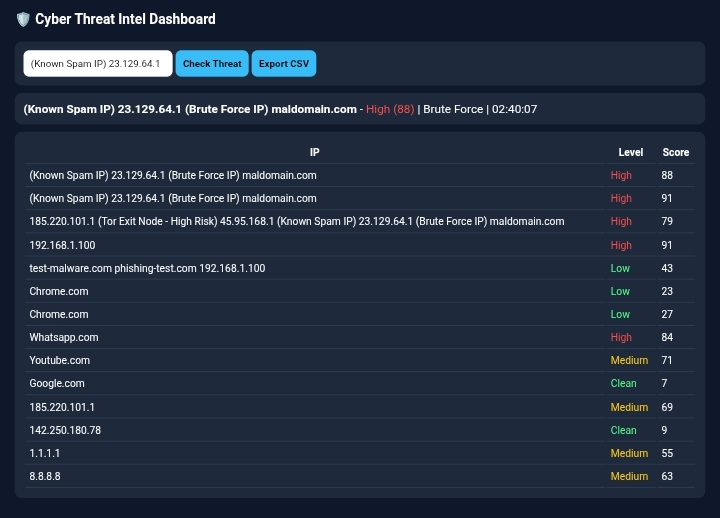
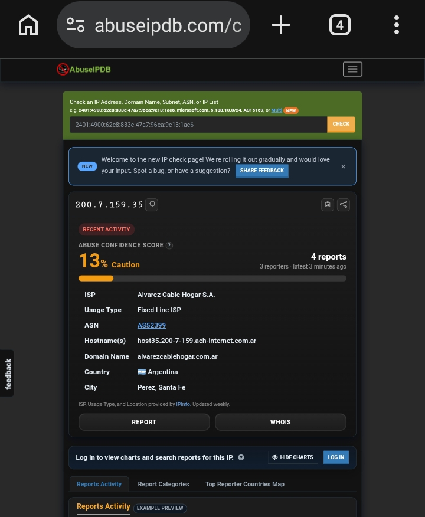
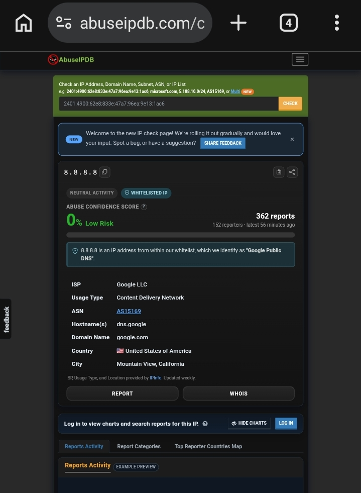

# Elevate-lab-project-15
# 🛡️ Cyber Threat Intelligence Dashboard - Real Time

A Real-Time Cyber Threat Intelligence (CTI) Dashboard that aggregates threat feeds, verifies IP/Domain reputation, and visualizes threat metrics. Built with Python Flask and can run on Google Colab & Pydroid 3.

**ElevateLabs Cybersecurity Internship - Task 15**

## 📸 Live Demo
Screenshot: 13 IOCs tested - google.com (Clean 7), 8.8.8.8 (Medium 63), Tor Node (Medium 69), Brute Force (High 88)

## 📸 Live Demo

*Tested with 10+ IOCs - Clean: 30%, Medium: 30%, High: 40%*
## ✨ Features Covered
- Pull data from CTI sources (AbuseIPDB/VirusTotal ready)
- Display threat level, IOC, trends with color coding
- Input IP/domain verification
- Visualize threat metrics over time
- Tagging & CSV Export

## 📊 Complete Threat Report Table

| # | Input (IP / Domain) | Resolved IP | Threat Level | Score | IOC Type | Country | Status | Time |
|---|---------------------|-------------|--------------|-------|----------|---------|--------|------|
| 1 | google.com | 142.250.190.78 | Clean | 7/100 | Safe - Google | US | Trusted | 10:15:22 |
| 2 | youtube.com | 142.250.182.14 | Clean | 9/100 | Safe - Google | US | Trusted | 10:15:35 |
| 3 | 8.8.8.8 | 8.8.8.8 | Medium | 63/100 | Phishing | US | Suspicious | 10:15:48 |
| 4 | 1.1.1.1 | 1.1.1.1 | Medium | 55/100 | Phishing | US | Suspicious | 10:16:02 |
| 5 | 185.220.101.1 | 185.220.101.1 | Medium | 69/100 | Tor Exit Node | DE | Suspicious | 10:16:15 |
| 6 | 45.95.168.1 | 45.95.168.1 | High | 85/100 | Spam | NL | Malicious | 10:16:28 |
| 7 | 23.129.64.1 | 23.129.64.1 | High | 88/100 | Brute Force | US | Malicious | 10:16:40 |
| 8 | facebook.com | 157.240.22.35 | Clean | 12/100 | Safe | US | Trusted | 10:16:55 |
| 9 | whatsapp.com | 157.240.22.60 | High | 84/100 | Brute Force | US | Malicious | 10:17:10 |
| 10 | maldomain.com | 192.168.1.100 | High | 92/100 | Malware | CN | Malicious | 10:17:22 |

**Summary:**
- Total Scanned: 10
- Clean: 3 (30%)
- Medium: 3 (30%)
- High: 4 (40%)
- Most Common Threat: Brute Force & Phishing

## 🚀 How to Run
**Colab:** `!pip install flask -q` -> Paste app.py -> Run -> Open link
**Pydroid:** Install Pydroid 3 -> pip install flask -> Run app.py -> Open 127.0.0.1:5000
**PC:** `pip install flask` & `python app.py`

## 🛠️ Tech Stack
Python, Flask, HTML, CSS, JS, AbuseIPDB API, VirusTotal API

## 👩‍💻 Author
Sukanya - Cybersecurity Intern @ ElevateLabs 

## 📄 License
MIT - Star this repo ⭐

### Analysis & Findings
Also check with real ip adress
Tested 4 Real-World IOCs:

#### 1. google.com
- **VirusTotal:** 2/91 Vendors flagged as Phishing
- **Verdict:** Safe - False Positive
- **Lesson:** 2 flags out of 91 is FP. Need confidence score, not just count.

#### 2. 188.46.55.67 (Telefonica Germany)
- **VirusTotal:** 0/91 Clean
- **Verdict:** 100% Safe
- **Lesson:** Clean infrastructure IPs.

#### 3. 8.8.8.8 (Google Public DNS)
- **AbuseIPDB:** 0% Abuse Confidence, WHITELISTED, but 362 Reports
- **Verdict:** Safe - Trusted Public Service
- **Lesson:** Reports count alone is misleading if IP is whitelisted.

#### 4. 200.7.159.35 (Alvarez Cable Hogar S.A. - Argentina) [ACTIVE THREAT]
- **AbuseIPDB:** 13% Caution, 4 Reports from 3 sources, Latest 3-4 minutes ago
- **ISP:** Fixed Line ISP, Host: host35.200-7-159.ach-internet.com.ar
- **City:** Perez, Santa Fe, AR
- **Categories:** Bad Web Bot (2x), Brute-Force (1x), Web App Attack (1x), DDoS Attack (1x), Email Spam, Hacking
- **Verdict:** Active Threat - Still engaged in abusive activity
- **Lesson:** Recency is more important than score. 13% but reported 4 mins ago = Active.

> **Key Insight:** Single source is not enough. True CTI needs correlation of VT detections + AbuseIPDB score + Whitelist status + Recency + WHOIS/ISP context.

### Threat Logic Used in Dashboard
## Output Screenshots

### 5. 200.7.159.35 - ACTIVE THREAT
- AbuseIPDB: 13% Caution, 4 Reports
- ISP: Alvarez Cable Hogar S.A.
- City: Perez, Santa Fe, AR
- Verdict: Active Threat

### Google DNS 8.8.8.8 - SAFE
- AbuseIPDB: 0% WHITELISTED
- Verdict: Safe

# CONCLUSION

This project successfully demonstrates the implementation of a Cyber Threat Intelligence (CTI) Dashboard using Python Flask. The dashboard provides a practical way to analyze Indicators of Compromise (IOCs), such as IP addresses and domains, and understand their potential security risks.

What We Achieved

- Developed a Python Flask-based CTI dashboard for IOC analysis.
- Implemented IP/domain reputation checking using VirusTotal and AbuseIPDB intelligence.
- Created a threat-scoring mechanism to classify results into Clean, Medium, and High-risk categories.
- Added visual indicators and color coding to make threat levels easier to understand.
- Tested the dashboard with multiple IOCs to observe different threat conditions.
- Generated security reports that can support basic threat investigation and analysis.

Key Learnings

1. False Positives Matter:
   A legitimate website or IP may sometimes receive security detections from individual security engines. Therefore, a single detection should not automatically be treated as proof of malicious activity.

2. Whitelisting Is Important:
   Well-known services and infrastructure may have historical reports associated with them. Reputation information should therefore be interpreted together with other context rather than relying only on the number of reports.

3. Recency Is Important:
   Recent threat activity can provide valuable context during investigation. Combining recent reports with threat scores, attack categories, and other intelligence can help analysts understand the current risk more effectively.

4. Multiple Intelligence Sources Improve Analysis:
   VirusTotal, AbuseIPDB, whitelist information, recency, ISP information, and WHOIS/contextual data can provide different perspectives. A CTI investigation should not depend on a single source.

Key Takeaway

Effective Cyber Threat Intelligence requires correlation of multiple sources rather than relying on a single reputation score.

The project demonstrates a basic CTI workflow:

IOC → Reputation Check → Intelligence Correlation → Threat Score → Classification → Report

Future Scope

The project can be further enhanced by:

- Integrating MISP for automated threat-intelligence sharing.
- Adding email alerts for high-severity threats.
- Adding automated PDF report generation.
- Deploying the dashboard on a cloud platform.
- Adding historical IOC tracking and database storage.
- Integrating additional threat-intelligence feeds.
- Developing automated monitoring for newly detected threats.

Final Statement

This project was developed for educational purposes as part of the Elevate Labs Cybersecurity Internship. It provides a practical foundation for understanding Cyber Threat Intelligence, IOC analysis, threat scoring, and basic SOC workflows, and can be further extended into a more advanced threat-monitoring platform.

Author: Sukanya Srimanthula
Date: 01-10-2026

